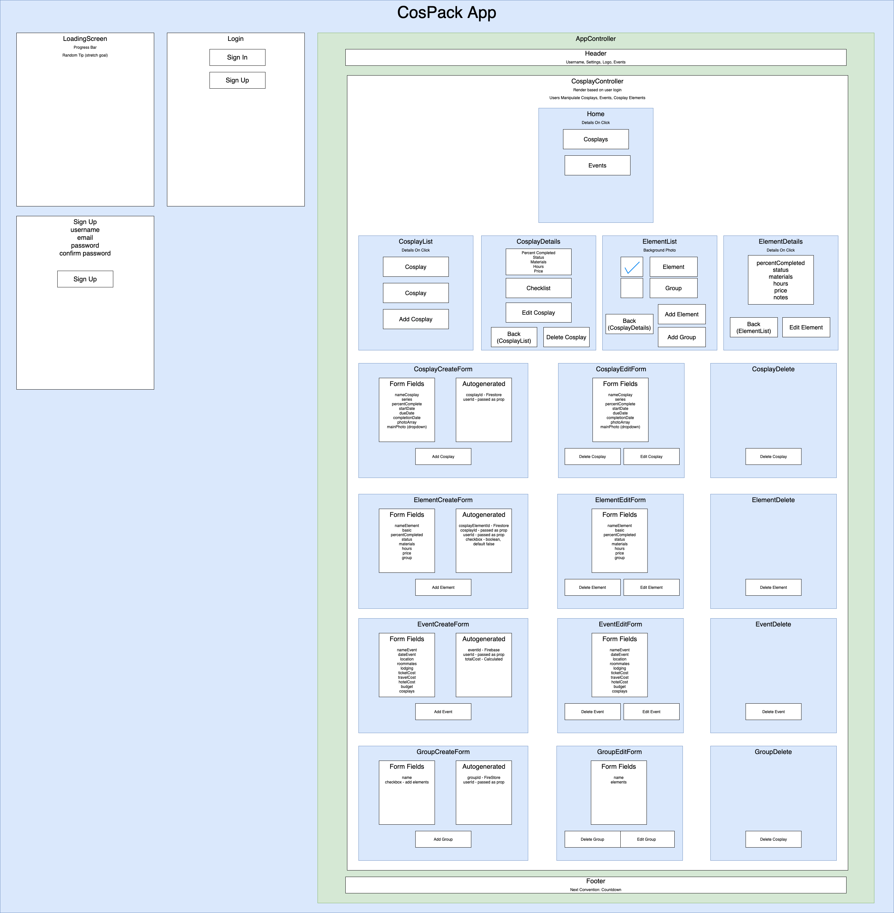
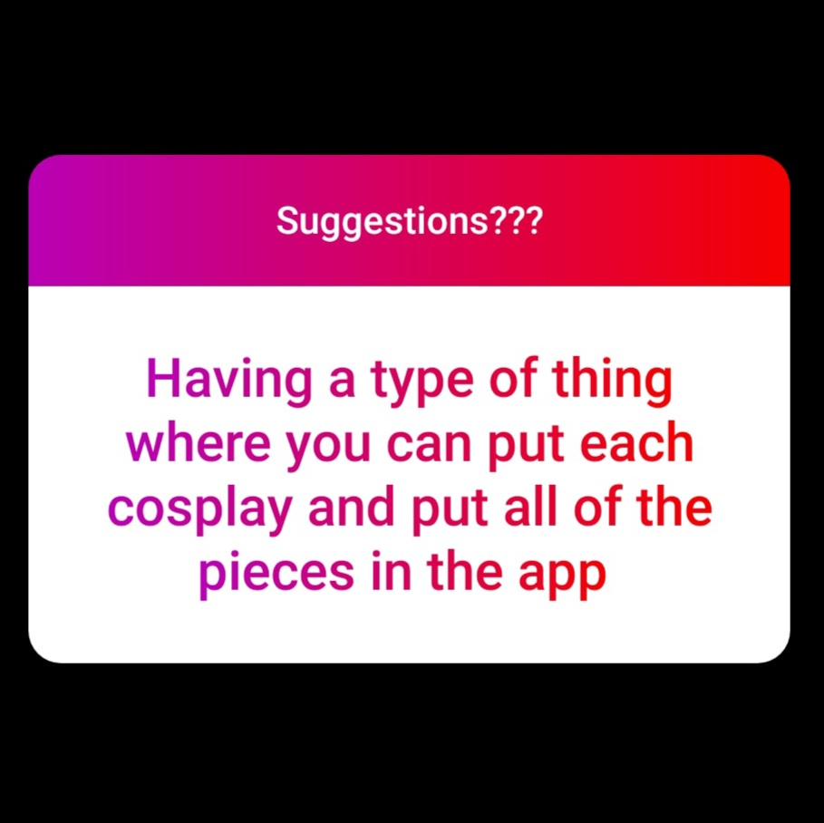
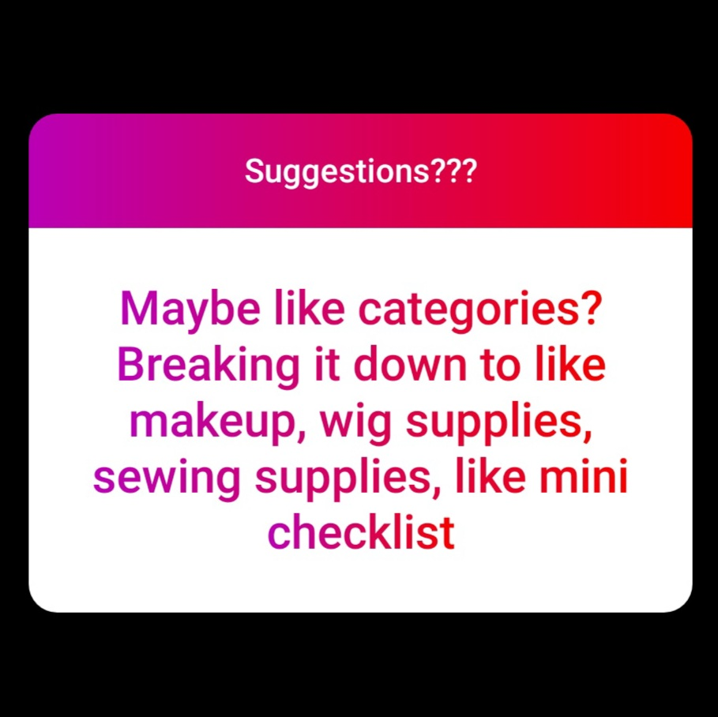
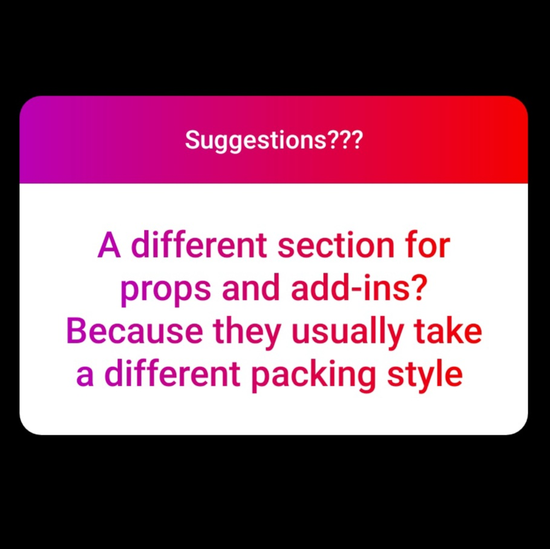
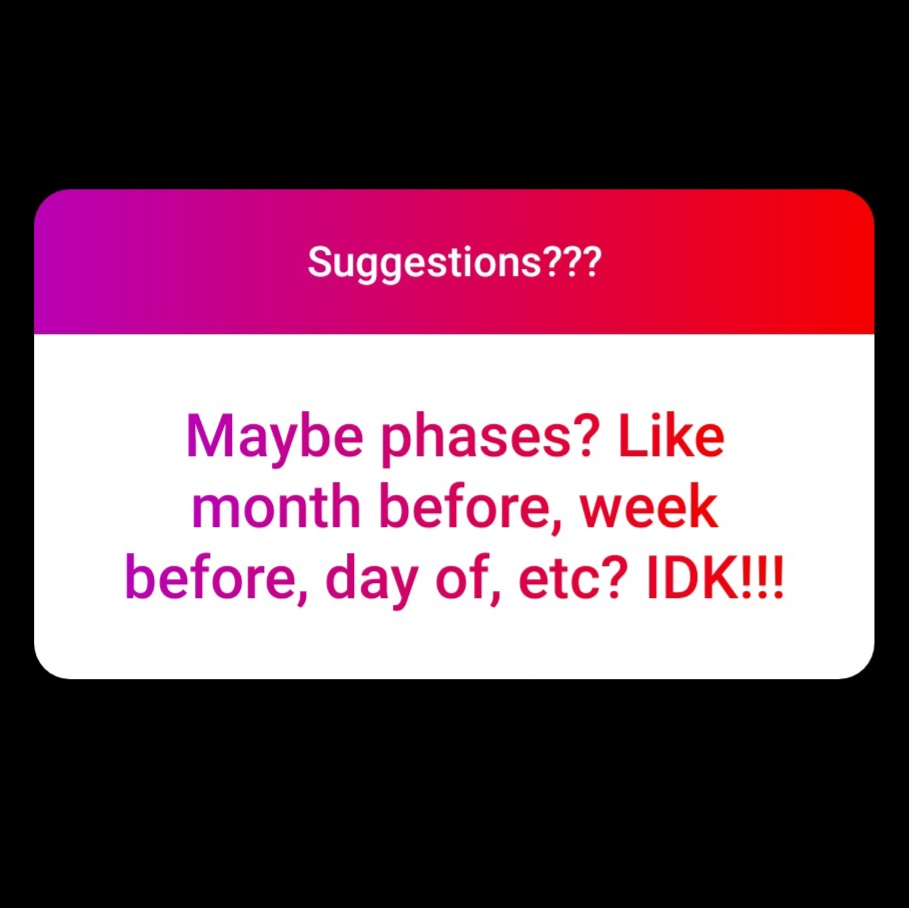

# **CosPack**

### _Capstone Project at Epicodus_

#### Author: **Jessica Hvozdovich**
#### July 17, 2020

<!--  -->

### Description

Cosplayers have a lot to keep track of! Between costumes, props, makeup, repair supplies, toiletries, and miscellaneous gear, so many essentials can be forgotten after a whirlwind of con prep. CosPack is an app that can be used as a cosplay to do list or packing list. Upload a photo and label elements of your costume for a visual checklist go to through before you head out the door for your next big event. Mark items that need repair or need completion, track your progress, and feel confident that you haven’t forgotten that wig you spent two weeks styling, the magic earrings central to your character’s powers, or that expensive as heck 8ft long sword you commissioned.

_This mobile application serves as an interactive, visual checklist application to help cosplayers pack for conventions and photoshoots, preventing forgotten items.  Full CRUD functionality is achieved with React Native and Firebase. A one to many relationship is set up between cosplays and their components._

### Instructions for use:
<!-- * Non android users will need an emulator! FIND INSTRUCTIONS -->

1. Open Terminal (macOS) or PowerShell (Windows)
2. To download the project Directory to your desktop enter the following commands:
```
cd Desktop
git clone https://github.com/jhvozdovich/cospack.git
cd cospack
```
3. To view the downloaded files, open them in a text editor or IDE of your choice.
* if you have VSCode for example, when your terminal is within the main project Directory you can open all of the files with the command:
```
code .
```
4. Download node and node package manager if they are not already installed on your device. You can find further instructions [here](https://www.learnhowtoprogram.com/intermediate-javascript/getting-started-with-javascript-8d3b52cf-3755-481d-80c5-46f1d3a8ffeb/installing-node-js-14f2721a-61e0-44b3-af1f-73f17348c8f4).
5. Run npm install in your terminal to download the necessary dependencies, plugins, and modules.
```
npm install
```
6. The command npm run start will build and open the compiled code in a browser of your choice using a local host.
```
npm start
```
7. Install the Expo app on your android phone from the Google Play store and scan the QR code in the terminal or the live share to run the app on your divice.


### Known Bugs

* Troubleshooting div wrapping within columns. Exploring flexbox in CSS.

### Support and Contact Information

Please contact me with any suggestions or questions at jhvozdovich@gmail.com. Thank you for your input!  
_Have a bug or an issue with this application? [Open a new issue](https://github.com/jhvozdovich/cospack/issues) here on GitHub._

### Technologies Used

* React Native
* Redux
* JSX
* JavaScript
* Jest
* CSS
* Git and GitHub

### Project Structure



### Specs
| Spec | Input | Output |
| :------------- | :------------- | :------------- |
| **User enters the app on a splash page** | User Input: "Open App" | Output: “Welcome to CosPack! View the Archives, Begin a New Adventure" |
| **User can view a list of cosplays** | User Input: "View Cosplays" | Output: “Lilith, Phos, Mimikyu" |
| **User can create a new cosplay** | User Input: "Add Cosplay" | Output: “Cosplay Form" |
| **User can view cosplay details** | User Input: "Click-Phos" | Output: “Character:Phos, Series: Houseki No Kuni, Date Started: January 20, 2019, Date Completed: March 14, 2019 (Percent completed and deadline display if not)" |
| **User can update cosplay details** | User Input: "Edit Cosplay" | Output: “Update Form" |
| **User can delete a cosplay** | User Input: "Delete" | Output: “Are you sure you want to remove *-Cosplay Name?-*" |
| **User can confirm deletion of a cosplay** | User Input: "Are you sure? Yes" | Output: “Cosplay Removed, Return to List View" |
| **User can view a list of cosplay elements** | User Input: "See Cosplay Pieces" | Output: “Cosplay Element List Displayed" |
| **User can view cosplay element details** | User Input: "Click Wig" | Output: “Wig Details Displayed" |
| **User can add a new cosplay element** | User Input: "Add Item" | Output: “Item Form Displayed: Name, Complete Boolean, Percentage Slider if not, Lost/Damaged Boolean, Time Spent Working, Deadline Calendar" |
| **User can update a cosplay element** | User Input: "Edit Element" | Output: “Edit form displayed" |
| **User can delete a cosplay element** | User Input: "Delete" | Output: “Are you sure you want to remove *-Element Name-*?" |
| **User can confirm deletion of a cosplay element** | User Input: "Are you sure? Yes" | Output: “Element Removed, Return to List View" |
| **User upload a photo of a cosplay** | User Input: "Add photo" | Output: “Detail Page has photo, blank choose your character stock previously" |
| **User can link cosplay elements to different parts of the photo** | User Input: "Zoom and Select/Draw/Highlight?" | Output: “Element Linked" |
| **User can sign up** | User Input: "username, password, email" | Output: "Home Page" |
| **Error displays if username or email is already in use** | User Input: "username, password, email" | Output: "Sorry an account already exists with this name!" |
| **User can login** | User Input: "username, password" | Output: "Home Page" |
| **Error displays for invalid credentials** | User Input: "username, password" | Output: “Sorry your username or password was incorrect!" |
| **User can only see their own cosplay data** | User Input: "Login" | Output: “User Projects only in display and details, link with user id?" |


### Stretch Goals
* Calendar for project planning, deadlines, and scheduling
* User can draw on photos to color code items as complete, missing, broken, or in progress
* Templates are added with common items like wig, shoes, contacts
* User can add multiple reference photos to a project and one main checklist photo
* Checklist mode - app pops up modal for each item associated with cosplay with options "Packed or NOT PACKED", color codes image or list
* Optional subgroups - clothes, accessories, props, or more freeform list
* Budget and warnings/updates as supply costs are added
* Notification options
* Customizable UI - pixel filter for photos?
* Calculate percentage complete based on percentage of all associated elements and total time logged
* Events- can add cosplays to events
* User can change order of cosplays in list
* Photo gallery

### User Stories
* As a cosplayer, I want a packing checklist so that I will be sure to remember all of my supplies before big events.
* I running on little sleep and still finishing everything before the con so I need a visual, intuitive app that will help walk me through the packing process.
* I don't want to stress about forgetting important parts of my costume that I worked hard on!
* This app needs to be free, easy to use, and secure! I'm on a budget and don't want to fuss with something clunky.
* The UI should be cute and something I'd want to screenshot and share.

### User Suggestions from Social Media

   

#### License

This software is licensed under the MIT license.

Copyright © 2020 **_Jessica Hvozdovich_**
